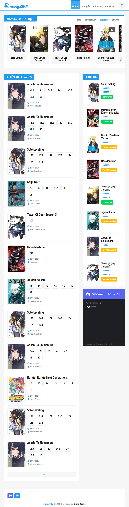

# **Demonstração**
* [Demonstração](https://www.youtube.com/watch?v=Xzu5dm_pWH8)

<i>Para adquirir entre em <a href="#contact">contato</a>.</i>

# **Sumário**

## **mangaSKY**
* [Sobre o mangaSKY](#about_mangasky)
* [Screenshot](#screenshot_mangasky)
* [API](#api_mangasky)
* [Mapa do site](#sitemap_mangasky)
* [Tecnologias](#technologies_mangasky)
    * [Front-end](#technologies_frontend_mangasky)
        * [Construção do site](#build_frontend_mangasky)
        * [Estilização](#style_frontend_mangasky)
        * [IDEs, versionamento](#tools_frontend_mangasky)
    * [Back-end](#technologies_backend_mangasky)
        * [Construção do site](#build_backend_mangasky)
        * [Banco de dados](#database_backend_mangasky)
        * [IDEs, versionamento](#tools_backend_mangasky)

## **FireCMS**
* [Sobre o FireCMS](#about_firecms)
* [Sistema](#system_firecms)
* [Mapa do site](#sitemap_firecms)
* [Tecnologias](#technologies_firecms)
    * [Construção do site](#build_firecms)
    * [Banco de dados](#database_firecms)
    * [IDEs, versionamento](#tools_firecms)

### **Sobre o mangaSKY**

O mangaSKY é uma plataforma tecnológica de ponta, construída com o objetivo de revolucionar a forma como os mangás são consumidos. Através de um sistema de filtragem e busca avançado, aliado a um design moderno e intuitivo, o mangaSKY oferece uma experiência de leitura única e personalizada. A plataforma utiliza as mais recentes tecnologias para garantir a melhor qualidade de imagem e um carregamento rápido das páginas, proporcionando uma experiência fluida e sem interrupções.

### **`Screenshot`**
<h1 align="center"></h1>

### **API**
* Mangás em destaque (Dia/Semana/Mês/Ano)
* Capítulos recém adicionados

### **Mapa do site**

#### Página inicial
* Caixa de pesquisa de mangás
* Mangás em destaque (Dia/Semana/Mês/Ano)
* Capítulos recém adicionados
* Ranking

#### Cabeçalho
* Menu de navegação
* Caixa de pesquisa de mangás

#### Lista de mangás
* Filtrar conteúdo por letras
* Filtrar conteúdo por gêneros
* Filtrar conteúdo por tipo
* Filtrar conteúdo por status
* Ordenação de conteúdo
* Lista de mangás

#### Gêneros
* Lista de gêneros

#### Contato
* Formulário de contato

#### Pesquisa
* Caixa de pesquisa de mangás
* Filtrar pesquisa por título
* Filtrar pesquisa por status

#### Mangá
* Resumo do mangá (Capa/Nome/Tipo/Gêneros/Sinopse)
* Tabela de ficha de dados (Informações do mangá)
* Compartilhamento com redes sociais
* Lista de capítulos
* Comentários

#### Leitor de capítulo
* Nome do mangá
* Breadcrumbs (Site/Mangás/Mangá/Capítulo)
* Menu de navegação de capítulos
* Menu de navegação das páginas
* Modo de leitura horizontal
* Compartilhamento com redes sociais
* Comentários

### **Tecnologias**

### `Front-end`

#### Construção do site
* [HTML](https://developer.mozilla.org/pt-BR/docs/Web/HTML)
* [JavaScript](https://developer.mozilla.org/pt-BR/docs/Web/JavaScript)
* [jQuery](https://jquery.com)

#### Estilização
* [CSS](https://developer.mozilla.org/pt-BR/docs/Web/CSS)
* [Sass/SCSS](https://sass-lang.com)
* [FontAwesome](https://fontawesome.com)

### IDEs, versionamento
* [Visual Studio Code](https://code.visualstudio.com)
* [Git](https://git-scm.com)
* [GitHub](https://github.com)

### `Back-end`

### Construção do site
* [PHP 8.2](https://www.php.net)
* [Laravel 10](https://laravel.com)

### Banco de dados
* [MySQL 5.7](https://mysql.com)

### IDEs, versionamento
* [Visual Studio Code](https://code.visualstudio.com)
* [Git](https://git-scm.com)
* [GitHub](https://github.com)

## **Sobre o FireCMS**

O FireCMS é uma plataforma de gerenciamento de conteúdo intuitiva e poderosa, projetada especificamente para administrar sites de leitura de quadrinhos. Com o FireCMS, você pode facilmente gerenciar usuários, adicionar obras, capítulos e páginas, além de organizar seus conteúdos por gêneros e categorias. Sua interface amigável e sistema de banco de dados robusto eliminam a necessidade de conhecimentos em programação, permitindo que você se concentre em criar e manter um site de alta qualidade.

### **Sistema**
* Níveis de acesso para usuários
    * Estagiário
    * Uploader
    * Administrador
* Usuários inativos não podem acessar o `dashboard`

### **Mapa do site**

#### Página de autenticação
* Formulário de autenticação

#### Página inicial do `dashboard`
* Estatísticas (Equipe/Mangás/Capítulos/Visualizações)
* Estatísticas de visualizações (Dia/Semana/Mês/Ano)

#### Cabeçalho
* Usuário autenticado
* Menu de autenticação

#### Barra lateral
* Menu das páginas do `dashboard`

#### Usuários

#### `Listas de usuários`
* Caixa de pesquisa de usuários
* Filtrar por tipo
* Filtrar por status
* Ordenação de usuários
* Lista de usuários

#### `Cadastrar usuário`
* Formulário de cadastro

#### `Editar usuário`
* Informações do usuário
* Formulário de edição

#### `Informações do usuário`
* Informações do usuário
* Mangás adicionados
* Capítulos adicionados

#### Mangás

#### `Lista de mangás`
* Caixa de pesquisa de mangás
* Filtrar por tipo
* Filtrar por status
* Ordenação de conteúdo
* Lista de mangás

#### `Cadastrar mangá`
* Formulário de cadastro

#### `Editar mangá`
* Informações do mangá
* Formulário de edição

#### `Infromações do mangá`
* Informações do mangá
* Capítulos do mangá

#### `Excluir mangá`
* `Feedback` do mangá
* Confirmação para exclusão do mangá

#### Capítulos

#### `Lista de capítulos`
* Filtrar por status (Não publicado/publicado)
* Ordenação de conteúdo
* Lista de capítulos

#### `Adicionar capítulo`
* Informações do mangá
* Formulário para adicionar

#### `Editar capítulo`
* Informações do capítulo
* Formulário de edição

#### `Excluir capítulo`
* `Feedback` do capítulo
* Confirmação para exclusão do capítulo

#### `Adicionar páginas`
* Informações do capítulo
* Formulário para adicionar

#### `Excluir páginas`
* `Feedback` do capítulo
* Confirmação para exclusão das páginas

#### Tipos

#### `Lista de tipos`
* Listas de tipos

#### `Adicionar gênero`
* Formulário para adicionar

#### `Informação do tipo`
* Informações do tipo

#### `Edição de tipo`
* Informações do tipo
* Formulário de edição

#### `Excluir tipo`
* `Feedback` do tipo
* Confirmação para exclusão do tipo

#### Gêneros

#### `Lista de gêneros`
* Lista de gêneros

#### `Adicionar gênero`
* Formulário para adicionar

#### `Informações do gênero`
* Informações do gênero

#### `Edição de gênero`
* Informações do gênero
* Formulário de edição

#### `Excluir gênero`
* `Feedback` do gênero
* Confirmação para exclusão do gênero

### **Tecnologias**

### Construção do site
* [Nazox (Theme)](https://themeforest.net/item/nazox-admin-dashboard-template/26819788)
* [PHP 8.2](https://www.php.net)
* [Laravel 10](https://laravel.com)

### Banco de dados
* [MySQL 5.7](https://mysql.com)

### IDEs, versionamento
* [Visual Studio Code](https://code.visualstudio.com)
* [Git](https://git-scm.com)
* [GitHub](https://github.com)

## Contato
* **E-mail:** 
    * *eu.brunocoelho94@gmail.com*
* **WhatsApp:** 
    * *(41) 98738-9397 (somente texto)*